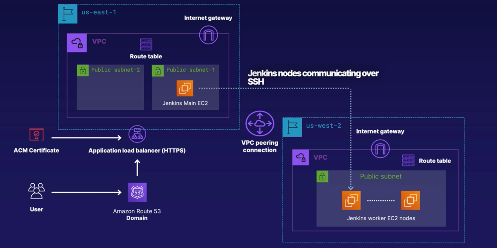

# Infrastructure as Code: Terraform and Ansible
This repository contains Terraform and Ansible deployments that can be used to stand up a sample Jenkins CI/CD environment on AWS across distributed, load-balanced networks. 

The Terraform configuration files included in this repo will stand up two VPCs in separate regions -- us-east-1 and us-west-2. The VPC in us-east-1 serves as the location for hosting the Jenkins master EC2 instance in one of its public subnets. The VPC in us-west-2 serves to host the Jenkins worker EC2 nodes in its public subnet. The two VPCs are then connected through a VPC peering connection to enable communication between the Jenkins master and worker nodes. 

After the configuration files are deployed, users can access the Jenkins master node via a Route53 domain that hits an application load balancer for handling traffic. 

## Network Architecture

## Deploying the Infrastructure
